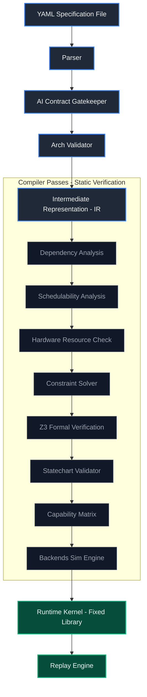

# NexForge v6.0 — Proof of Concept (Repository omnia)

**A robust architecture to constrain artificial intelligence in Cyber-Physical Systems (CPS)**

What is NexForge?

NexForge is a compiler + fixed safety kernel that transforms a high-level system description (YAML) into a fully verified, deterministic safety layer.

Core Idea:

"Architecture Engineering > Prompt Engineering"

Instead of trusting an LLM not to hallucinate dangerous commands, we constrain it with a hard safety layer it cannot bypass. NexForge is not a replacement for ROS2, MicroSafe-RL, or apyrobo it is a specification compiler that feeds verified safety contracts into those frameworks.

**Keywords:** CPS, Safety-Critical Systems, IoT Security, Embedded Systems, Formal Verification, Deterministic Compiler, Functional Safety, YAML-driven, VETO-first, Constrained Architecture, Industrial Automation, Robotics

---

## 🎯 What is this project?

NexForge is a **compiler + hard kernel** that transforms a simple domain description (YAML) into a CPS simulation system:
- ✅ Reads YAML and translates it into a fixed Intermediate Representation (IR).
- ✅ Checks 12 strict architectural rules (no duplicates, no invalid references).
- ✅ Performs dimensional analysis (SI units) and prevents mixing (no Volts + Celsius).
- ✅ Solves real ordinary differential equations (ODE).
- ✅ Runs a Safety Guardian that monitors contracts every 10 ms.
- ✅ If a safety contract is breached, it issues a **VETO** immediately and shuts down the system.
- ✅ Records the entire session, and you can replay it with exactly the same result.
- ✅ 17 unit tests (Pytest) passing.

**All of this from a single YAML file – without writing any runtime code.**

---

## 🏗️ System Architecture

NexForge uses a strict, unidirectional compiler pipeline that enforces static safety contracts before generating or executing the runtime kernel:



## ✅ What was actually achieved (Proof of Concept)

We successfully ran the project on **three different real-world domains**, proving the architecture is **Domain‑Agnostic** (independent of the field):

| Domain | YAML file | Contracts | Faults tested | VETO result |
|--------|-----------|:--------:|----------------------|:--------:|
| Water Pump | `domains/pump.yaml` | 3 | Motor failure, Overheating | ✅ VETO + SHUTDOWN |
| EV Charger | `domains/ev_charger.yaml` | 4 | Plug disconnect, Ground fault | ✅ Multiple VETOs |
| Data Center Fan | `domains/datacenter_fan.yaml` | 6 | Vibration, Stall, Overheating | ✅ 3 different contracts triggered |

**All of this was done without modifying the core Runtime Kernel. The only change was a small fix in the simulator (`physics.py`) to inject faults directly into the physical state.**

---

## 🧠 Why developers will be interested

| What they'll find | Why it matters |
|-------------------|----------------|
| **Novel idea** | "Constrained Architecture" – limiting AI within a rigid architecture, instead of dangerous free code. |
| **Ready foundation** | Safety Engine + Compiler + Validator ready to use and modify. |
| **Easy to extend** | Add any new domain (elevator, fridge, drone) just with a YAML file – no core changes. |
| **Safe test environment** | Test safety ideas in simulation before touching a real machine. |
| **Educational tool** | Suitable for universities teaching safety-critical systems engineering. |
| **Open future** | Clear roadmap towards Multi‑Agent, ESP32, Dashboard, and LLM Integration. |
| **Open source** | Apache License – use it, modify it, contribute freely. |

---

## 🧩 Extensibility (Plugin Domains)

Any domain can be added **without modifying the core** as long as it respects this YAML structure:

```yaml
metadata:
  name: domain_name
  description: "description"
sensors: [ { name: x, unit: U, min: a, max: b, default: c }, ... ]
actuators: [ { name: y, unit: U, min: a, max: b, default: c, fail_safe_value: f }, ... ]
contracts:
  - name: contract_name
    assume: "expression"
    guarantee: "expression"
    reason: "reason for tripping"
    safety_class: CRITICAL
physics:
  states: [ { name: var, unit: U, initial: val }, ... ]
  equations:
    var: "dx/dt = ..."
control:
  strategy: PID
  target_sensor: sensor_name
  output_actuator: actuator_name
  setpoint: target_value
timing: { safety_loop_hz: 100, control_loop_hz: 50, telemetry_hz: 10 }
deployment: { target: mock }
```

Examples that can be added right now: elevator, cold_storage, drone, nuclear_reactor.

---

## ⚠️ Important Warning

**This project is a Proof of Concept only.**

- ❌ Not suitable for direct use on real hardware (ESP32, STM32…)
- ❌ Currently uses MockHAL (fake hardware) for simulation
- ❌ Has not undergone independent safety audits or certifications

**Any use on real hardware is at the user's own risk.**

---

## 🚀 Quick Start

```bash
git clone https://github.com/Mouafek91/omnia-.git
cd omnia-
pip install -e .[dev]
pip install z3-solver
nexforge list-domains
nexforge compile domains/pump.yaml
nexforge simulate domains/pump.yaml -d 10 --scenario motor_failure --record sessions/run.json
pytest
```

**Expected test output (17/17 passing):**

```
tests/test_arch_validator.py::test_valid_pump_passes PASSED
tests/test_arch_validator.py::test_missing_sensor_reference_caught PASSED
tests/test_arch_validator.py::test_duplicate_names_caught PASSED
tests/test_events.py::test_priority_ordering PASSED
tests/test_events.py::test_bounded_queue_drops PASSED
tests/test_pipeline.py::test_pump_compiles PASSED
tests/test_pipeline.py::test_bad_unit_rejected PASSED
tests/test_replay.py::test_session_roundtrip PASSED
tests/test_replay.py::test_replay_detects_hash_mismatch PASSED
tests/test_scenarios.py::test_builtin_scenarios_registered PASSED
tests/test_scenarios.py::test_scenario_applicability PASSED
tests/test_scenarios.py::test_scenario_disturbances_deterministic PASSED
tests/test_units.py::test_add_same_unit PASSED
tests/test_units.py::test_add_different_units_fails PASSED
tests/test_units.py::test_multiply_units PASSED
tests/test_units.py::test_sin_requires_dimensionless PASSED
tests/test_units.py::test_evaluate_arithmetic PASSED

=================== 17 passed in 0.56s ===================
```

**You can also run custom scenarios:**

```powershell
python "run_sim motor failure - Copy.py"   # Motor failure → VETO
python "run_sim_overheating - Copy.py"              # Overheating → VETO
python run_sim_ev_charger.py               # EV charger → VETO
python run_sim_datacenter_fan.py           # Data center fan → VETO
```

> **Note:** `nexforge replay` requires the exact same YAML file used during recording. If you modify the YAML, re-record the session first.

## 👥 For Contributors
NexForge is the only open‑source project that attempts to unify safety across:

· Hardware clipping (MicroSafe‑RL style)
· ROS 2 infrastructure (safe_drive style)
· High‑level skill orchestration (apyrobo style)

under a single, verifiable YAML specification. If you care about making physical AI safe and deterministic, this is the place to build.

All contributions are welcome! The project is still in the Early Prototype stage, and your contribution will shape its future.

### ✅ What you can contribute (recommended and safe)

| Area | What to do |
|------|------------|
| Adding YAML domains | Put your file in `domains/` (elevator, fridge, fan, robot…) |
| Fault scenarios | Add a new scenario in `nexforge/scenarios/` |
| New tests | Add tests in `tests/` to cover new domains |
| Documentation | Translate docs, write examples, add diagrams |
| Plugin SDK | Add a Validator or Domain Plugin via `nexforge/plugins/` |

### ⚠️ Areas requiring caution (do not modify without deep understanding)

| Area | Why caution |
|------|-------------|
| Hard core (`nexforge/compiler/`, `nexforge/runtime/safety.py`) | Any error here affects determinism and safety. |
| IR Schema (`nexforge/compiler/ir.py`) | Changing it will impact all domains. |
| Safe Evaluator (`nexforge/compiler/expr.py`) | Any vulnerability here is a security risk. |

**Golden rule:** If your change would alter the core behavior for all domains, open an Issue first for discussion.

---

## 🛣️ Roadmap

### v6.0 (current) — Completed ✅

- Compiler + Validator + Safety Engine + Simulator + Replay
- Proof of concept demonstrated across 3 different physical domains

### v7.0 — Unified Safety Layer
- Generators for existing safety frameworks:
  - MicroSafe-RL (hard real-time clipping)
  - safe_drive (ROS 2 infrastructure)
  - apyrobo (high-level skill orchestration)
- One YAML → configurations for multiple specialized safety tools

### v8.0+ (Community Driven)
- Plugin system & SDK
- More domains (Drone, Robotic Arm, etc.)
- Web dashboard (optional)
- Multi-agent YAML generation (research direction)


## 📄 License

Apache License — use it, modify it, contribute freely.

---

**Lead Developer:** [Mouafek91](https://github.com/Mouafek91) (Tunisia)
**Project Status:** Early Prototype — Successful Proof of Concept
>>>>>>> 17b0418db9fc6d0b157813b53a6dd4f1649e0c23
